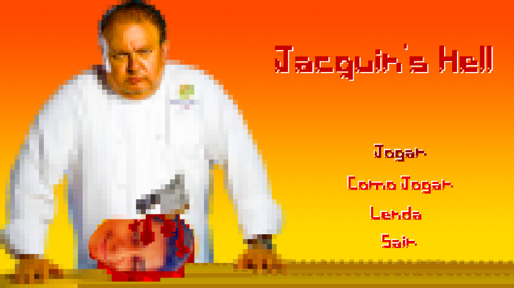
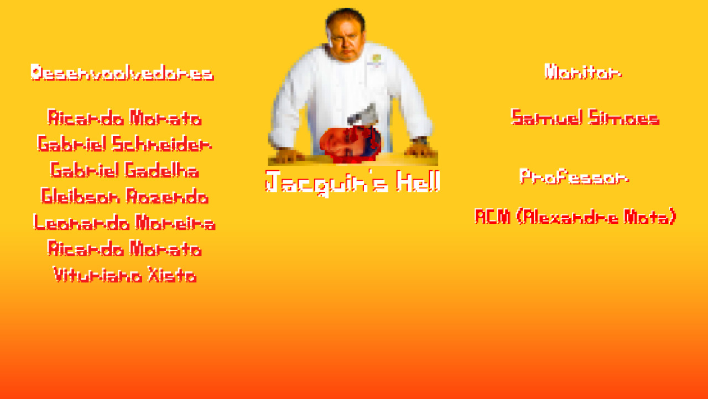
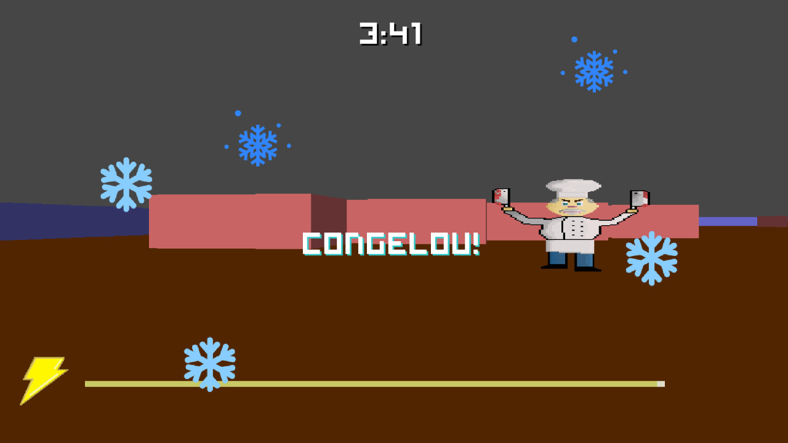
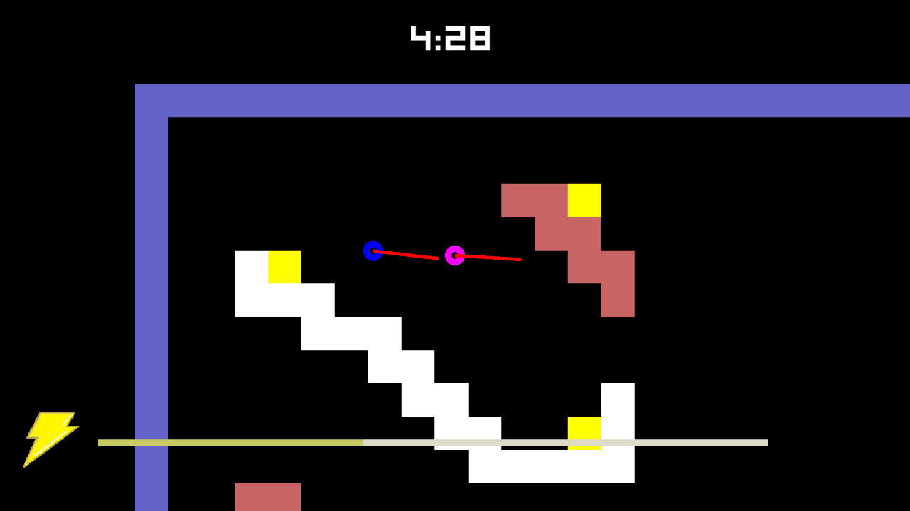

# if669-jogo
[Dcto](https://docs.google.com/document/d/1GUkAA6Tv_SgV5HuBIBtLkdRdiGoB3Gxj1L-__42aXpQ/edit)

# Screenshots

# TODO/Coisas para fazer
- Implementar as texturas.
- Som.
- Sprites tipo lâmpadas.
- As mecânicas do jogo não importantes que não foram implementadas.
- Gore?

## Comunicação
O servidor mantém uma struct com um vetor com os estados de todos os jogadores, (teclado, posição, etc) e recebe um byte de input dos jogadores, quando eles pressionam alguma tecla. 

Este byte encoda qual tecla esta sendo pressionada, se o evento foi de pressionamento 
ou soltura da tecla e um bit para checar se a mensagem é valida.

A cada ciclo o servidor deverá fazer o _broadcast modificado_ da struct com os estados para todos os jogadores, antes de enviar-la, ele a modifica inserindo o id do jogador que irá receber-la. 

